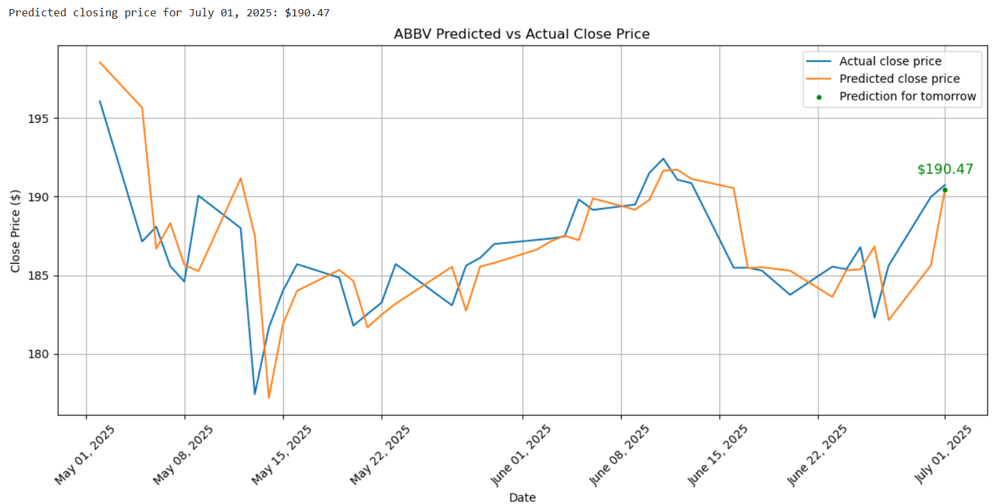

# Stock Price Predictor

This project is a machine learning-based stock price prediction system. It leverages 5 years of historical stock data for the company AbbVie(ABBV) and applies linear regression to forecast the next day's closing price.

The final output includes a clear visualization of model predictions, highlighting the most recent forecast with individual dates.

---

## Project Highlights

- Built a predictive model using real financial time-series data
- Applied **linear regression** to forecast short-term price movements
- Engineered multiple new features
- Visualized performance using **Matplotlib**, showing actual vs predicted prices over the last 2 months
- Utilized **sklearn, pandas, yfinance**
- Achieved test **R²** score of **0.9849**

---

## Example Graph Output

